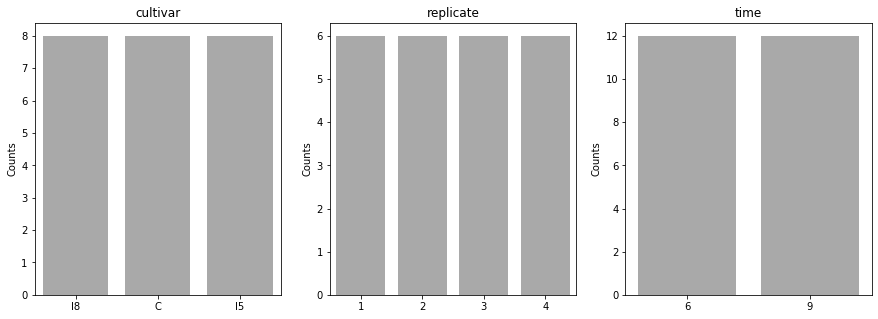
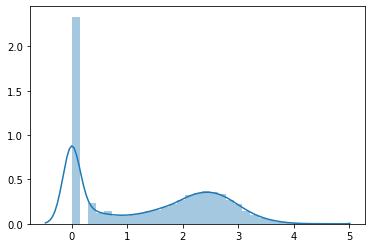
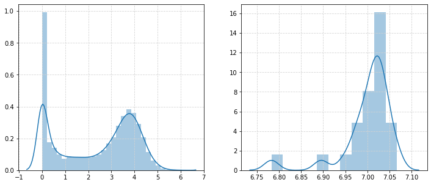
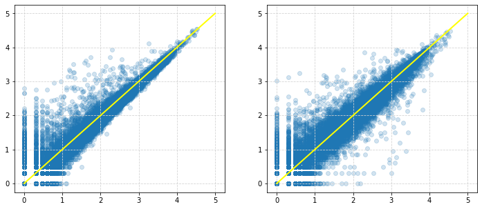
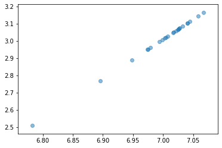
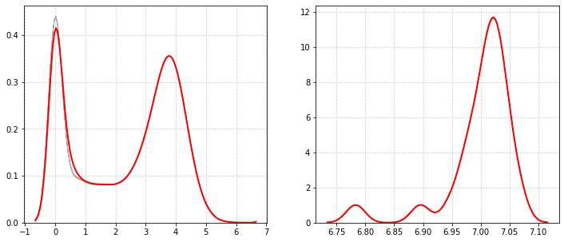
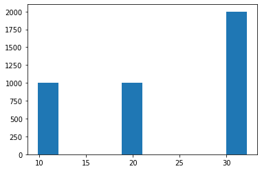

title: Bayesian (and non-) analysis of RNA-seq data with Stan

```python
import numpy as np
import pandas as pd
import pystan as stan
import seaborn as sns
from matplotlib import pyplot as plt
```


```python
RNASEQ_DATA_URL = "https://raw.githubusercontent.com/ucdavis-bioinformatics-training/2018-June-RNA-Seq-Workshop/master/thursday/all_counts.txt"
```


```python
rnaseq_df = (
    pd.read_table(RNASEQ_DATA_URL).
        transpose().
        astype("int64").
        reset_index().
        rename(columns={"index": "sample_id"})
)
```

    /home/ssoi/anaconda3/lib/python3.6/site-packages/ipykernel_launcher.py:2: FutureWarning: read_table is deprecated, use read_csv instead, passing sep='\t'.
      


```python
rnaseq_df["cultivar"] = [s[0:1] if s.startswith("C") else s[0:2] for s in rnaseq_df["sample_id"]]
rnaseq_df["replicate"] = rnaseq_df["sample_id"].str[-1]
rnaseq_df["time"] = [s[1:-1] if s.startswith("C") else s[2:-1] for s in rnaseq_df["sample_id"]]

metadata_cols = ["sample_id", "cultivar", "replicate", "time"]
gene_cols = [col for col in rnaseq_df if not col in metadata_cols]
```


```python
print(rnaseq_df.shape)
rnaseq_df.head()
```

    (24, 34266)


<div>
<style scoped>
    .dataframe tbody tr th:only-of-type {
        vertical-align: middle;
    }

    .dataframe tbody tr th {
        vertical-align: top;
    }

    .dataframe thead th {
        text-align: right;
    }
</style>
<table border="1" class="dataframe">
  <thead>
    <tr style="text-align: right;">
      <th></th>
      <th>sample_id</th>
      <th>AT1G01010</th>
      <th>AT1G01020</th>
      <th>AT1G03987</th>
      <th>AT1G01030</th>
      <th>AT1G01040</th>
      <th>AT1G03993</th>
      <th>AT1G01046</th>
      <th>ENSRNA049757489</th>
      <th>AT1G01050</th>
      <th>...</th>
      <th>ATCG01260</th>
      <th>ATCG01270</th>
      <th>ATCG01280</th>
      <th>ATCG01290</th>
      <th>ATCG01300</th>
      <th>ATCG01310</th>
      <th>ENSRNA049494914</th>
      <th>cultivar</th>
      <th>replicate</th>
      <th>time</th>
    </tr>
  </thead>
  <tbody>
    <tr>
      <th>0</th>
      <td>C61</td>
      <td>289</td>
      <td>127</td>
      <td>0</td>
      <td>17</td>
      <td>605</td>
      <td>1</td>
      <td>0</td>
      <td>0</td>
      <td>1164</td>
      <td>...</td>
      <td>1</td>
      <td>0</td>
      <td>0</td>
      <td>0</td>
      <td>0</td>
      <td>1</td>
      <td>0</td>
      <td>C</td>
      <td>1</td>
      <td>6</td>
    </tr>
    <tr>
      <th>1</th>
      <td>C62</td>
      <td>317</td>
      <td>78</td>
      <td>0</td>
      <td>25</td>
      <td>415</td>
      <td>1</td>
      <td>0</td>
      <td>0</td>
      <td>876</td>
      <td>...</td>
      <td>0</td>
      <td>0</td>
      <td>0</td>
      <td>0</td>
      <td>0</td>
      <td>0</td>
      <td>0</td>
      <td>C</td>
      <td>2</td>
      <td>6</td>
    </tr>
    <tr>
      <th>2</th>
      <td>C63</td>
      <td>225</td>
      <td>142</td>
      <td>0</td>
      <td>32</td>
      <td>506</td>
      <td>0</td>
      <td>0</td>
      <td>0</td>
      <td>935</td>
      <td>...</td>
      <td>0</td>
      <td>0</td>
      <td>0</td>
      <td>0</td>
      <td>0</td>
      <td>0</td>
      <td>0</td>
      <td>C</td>
      <td>3</td>
      <td>6</td>
    </tr>
    <tr>
      <th>3</th>
      <td>C64</td>
      <td>343</td>
      <td>130</td>
      <td>0</td>
      <td>24</td>
      <td>565</td>
      <td>0</td>
      <td>0</td>
      <td>0</td>
      <td>979</td>
      <td>...</td>
      <td>0</td>
      <td>0</td>
      <td>0</td>
      <td>0</td>
      <td>0</td>
      <td>1</td>
      <td>0</td>
      <td>C</td>
      <td>4</td>
      <td>6</td>
    </tr>
    <tr>
      <th>4</th>
      <td>C91</td>
      <td>325</td>
      <td>156</td>
      <td>0</td>
      <td>22</td>
      <td>762</td>
      <td>0</td>
      <td>0</td>
      <td>0</td>
      <td>1146</td>
      <td>...</td>
      <td>0</td>
      <td>0</td>
      <td>0</td>
      <td>0</td>
      <td>0</td>
      <td>0</td>
      <td>0</td>
      <td>C</td>
      <td>1</td>
      <td>9</td>
    </tr>
  </tbody>
</table>
<p>5 rows × 34266 columns</p>
</div>


```python
plt.figure(figsize=(15, 5))
for idx, col in enumerate(metadata_cols[1:], 1):
    plt.subplot(1, 3, idx)
    metadata_counts = rnaseq_df[col].value_counts()
    sns.barplot(metadata_counts.index, metadata_counts, color="darkgray")
    plt.ylabel("Counts")
    plt.title(col)
```


    

    


```python
sns.distplot(np.log10(1 + rnaseq_df[rnaseq_df["sample_id"] == "C61"][gene_cols].values))
```


    <matplotlib.axes._subplots.AxesSubplot at 0x7ff12d3c69e8>


    

    


```python
plt.figure(figsize=(12, 5))

plt.subplot(1, 2, 1)
sns.distplot(np.log10(1 + rnaseq_df[gene_cols].sum(axis=0)))
plt.grid(linestyle="--", color="lightgray")

plt.subplot(1, 2, 2)
sns.distplot(np.log10(rnaseq_df[gene_cols].sum(axis=1)))
plt.grid(linestyle="--", color="lightgray")
```


    

    


```python
plt.figure(figsize=(12, 5))
plt.subplot(1, 2, 1)
plt.scatter(
    x=np.log10(1 + rnaseq_df[rnaseq_df["sample_id"] == "C61"][gene_cols].values),
    y=np.log10(1 + rnaseq_df[rnaseq_df["sample_id"] == "C62"][gene_cols].values),
    alpha=0.2
)
plt.grid(linestyle="--", color="lightgray")
plt.plot(np.linspace(0, 5, 25), np.linspace(0, 5, 25), color="yellow", linewidth=2)

plt.subplot(1, 2, 2)
plt.scatter(
    x=np.log10(1 + rnaseq_df[rnaseq_df["sample_id"] == "C61"][gene_cols].values),
    y=np.log10(1 + rnaseq_df[rnaseq_df["sample_id"] == "C91"][gene_cols].values),
    alpha=0.2
)
plt.grid(linestyle="--", color="lightgray")
plt.plot(np.linspace(0, 5, 25), np.linspace(0, 5, 25), color="yellow", linewidth=2)
```


    [<matplotlib.lines.Line2D at 0x7ff0f80e5cc0>]


    

    


```python
gene_samp_code = """
data {
  int<lower=0> num_genes;  // number of genes
  int<lower=0> num_samps;  // number of samples
  // int<lower=0> num_cultivars;  // number of cultivars
  // int<lower=0> num_times;  // number of times
  // int<lower=0> cultivars[num_samps];
  // int<lower=0> times[num_samps];
  int<lower=0> counts[num_samps, num_genes]; // read counts
}
parameters {
  vector[num_genes] mu_gene;
  vector[num_samps] mu_samp; 
  // matrix[num_] beta_cultivar[num_cultivars];
  // real beta_time[num_times];
}
model {
  //for(s in 1:num_samps) {
    // mu_samp[s] = beta_cultivar[cultivars[s]] + 
    for(s in 1:num_samps) {
      counts[s] ~ poisson(exp(mu_samp[s] + mu_gene));
    }
  //}
}
"""

stan_data = {
    "num_genes": len(gene_cols),
    "num_samps": rnaseq_df.shape[0],
    "counts": rnaseq_df[gene_cols]
}
sm = stan.StanModel(model_code=gene_samp_code)
```


```python
%time fit = sm.sampling(data=stan_data, iter=1000, chains=1)
```


```python
plt.scatter(np.log10(1 + rnaseq_df[gene_cols].sum(axis=1)), posterior["mu_samp"].mean(axis=0), alpha=0.5)
```


    <matplotlib.collections.PathCollection at 0x7ff066528f98>


    

    


```python
#mu = np.zeros([24, 100])
#posterior["mu_samp"][0] + posterior["mu_gene"][0]
post_pred_counts = []
for idx in range(4000):
    post_pred_mupost_pred_mu = np.tile(posterior["mu_samp"][idx], (len(gene_cols), 1)).T + np.tile(posterior["mu_gene"][idx], (24, 1))
    post_pred_counts.append(np.random.poisson(np.exp(post_pred_mupost_pred_mu)))
```


```python
plt.figure(figsize=(12, 5))

kde_kws = {"color": "darkgray", "alpha": 0.1, "linewidth": 0.5}

plt.subplot(1, 2, 1)
for counts in post_pred_counts[0:100]:
    sns.distplot(np.log10(1 + counts.sum(axis=0)), hist=False, kde_kws=kde_kws)
sns.distplot(np.log10(1 + rnaseq_df[gene_cols].sum(axis=0)), hist=False, color="red", kde_kws={"linewidth": 2})
plt.grid(linestyle="--", color="lightgray")

plt.subplot(1, 2, 2)
for counts in post_pred_counts[0:100]:
    sns.distplot(np.log10(counts.sum(axis=1)), hist=False, kde_kws=kde_kws)
sns.distplot(np.log10(rnaseq_df[gene_cols].sum(axis=1)), hist=False, color="red", kde_kws={"linewidth": 2})
plt.grid(linestyle="--", color="lightgray")
```


    

    


```python
plt.hist((posterior["mu_samp[1]"])
```


    (array([1000.,    0.,    0.,    0., 1000.,    0.,    0.,    0.,    0.,
            2000.]),
     array([ 9.83049912, 12.06855354, 14.30660795, 16.54466237, 18.78271678,
            21.02077119, 23.25882561, 25.49688002, 27.73493444, 29.97298885,
            32.21104326]),
     <a list of 10 Patch objects>)


    

    

